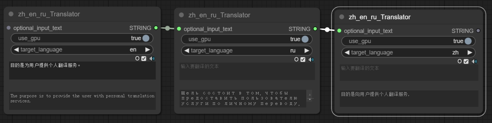
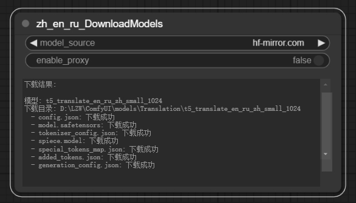

# ComfyUI-zh-en-ru-Translator
<strong>[English Version](./README_EN.md) | 中文</strong>

ComfyUI-zh-en-ru-Translator 是一个用于中文、英文和俄文之间互译的插件。


## 特性

- 支持中文、英文和俄文之间的互译（ru-zh, zh-ru, en-zh, zh-en, en-ru, ru-en）
- 自动检测源语言，支持多语言混合输入
- 自动检测并使用 GPU 加速
- 自带模型下载节点（支持）

## 安装
1. 进入 ComfyUI 的自定义节点目录：
    ```bash
    cd path/to/ComfyUI/custom_nodes
    ```

2. 克隆仓库：
    ```bash
    git clone https://github.com/1653lin4/ComfyUI-zh-en-ru-Translator.git
    ```
3. 使用的 Python 库都是 ComfyUI 已有的，所以不需要额外安装 Python 库。

### 下载模型
#### 方法1：使用下载节点（推荐）

- 使用 `zh_en_ru_DownloadModels` 节点，运行即可自动下载模型。
- 中国大陆用户建议选择 `hf-mirror.com` 作为模型源。
- 其他地区用户可以选择 `huggingface.co` 作为模型源。
- 默认使用本地网络，不需要额外的网络配置。

#### 方法2：手动下载
如果自动下载失败，您可以手动下载模型文件并放置在正确的目录中：

1. 点击以下任一链接下载模型文件：
   - 中国大陆：[hf-mirror.com](https://hf-mirror.com/utrobinmv/t5_translate_en_ru_zh_small_1024/tree/main)
   - 其他地区：[huggingface.co](https://huggingface.co/utrobinmv/t5_translate_en_ru_zh_small_1024/tree/main)

2. 下载以下文件：
   - config.json
   - model.safetensors
   - tokenizer_config.json
   - spiece.model
   - special_tokens_map.json
   - added_tokens.json
   - generation_config.json

3. 创建目录：`ComfyUI/models/Translation/t5_translate_en_ru_zh_small_1024/`

4. 将下载的文件放入上述目录中。


## 许可证

此项目基于 Apache License 2.0 许可证，详情请参阅 [LICENSE](./LICENSE) 文件。


## 致谢

本项目使用了 [utrobinmv](https://huggingface.co/utrobinmv) 开发的 t5_translate_en_ru_zh_small_1024 模型。该模型基于 Apache 2.0 许可证发布。
