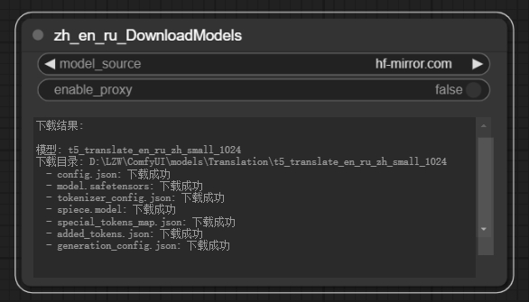

# ComfyUI-zh-en-ru-Translator
<strong>English Version | [中文](./README.md)</strong>

ComfyUI-zh-en-ru-Translator is a plugin for translation between Chinese, English, and Russian.


## Features

- Supports translation between Chinese, English, 和 Russian (ru-zh, zh-ru, en-zh, zh-en, en-ru, ru-en)
- Automatically detects source language, supports mixed language input
- Automatically detects and uses GPU acceleration
- Comes with a model download node (supported)

## Installation
1. Navigate to ComfyUI's custom nodes directory:
    ```bash
    cd path/to/ComfyUI/custom_nodes
    ```

2. Clone the repository:
    ```bash
    git clone https://github.com/1653lin4/ComfyUI-zh-en-ru-Translator.git
    ```
3. The Python libraries used are already included in ComfyUI, so no additional Python libraries need to be installed.

### Downloading the Model
#### Method 1: Using the Download Node (Recommended)

- Use the `zh_en_ru_DownloadModels` node, run it to automatically download the model.
- For users in mainland China, it is recommended to choose `hf-mirror.com`  as the model source.
- Users in other regions can choose `huggingface.co` as the model source.
- Uses local network by default, no additional network configuration needed.

#### Method 2: Manual Download
If automatic download fails, you can manually download the model files and place them in the correct directory:

1. Please click on any of the following links to download the model files:
   - Mainland China: [hf-mirror.com](https://hf-mirror.com/utrobinmv/t5_translate_en_ru_zh_small_1024/tree/main)
   - Other regions: [huggingface.co](https://huggingface.co/utrobinmv/t5_translate_en_ru_zh_small_1024/tree/main)
2. Download the following files:
   - config.json
   - model.safetensors
   - tokenizer_config.json
   - spiece.model
   - special_tokens_map.json
   - added_tokens.json
   - generation_config.json
3. Create directory: `ComfyUI/models/Translation/t5_translate_en_ru_zh_small_1024/`
4. Place the downloaded files into the above directory.


## License

This project is licensed under the Apache License 2.0, please refer to the [LICENSE](./LICENSE) file for details.


## Acknowledgements

This project uses the t5_translate_en_ru_zh_small_1024 model developed by [utrobinmv](https://huggingface.co/utrobinmv). This model is released under the Apache 2.0 license.
